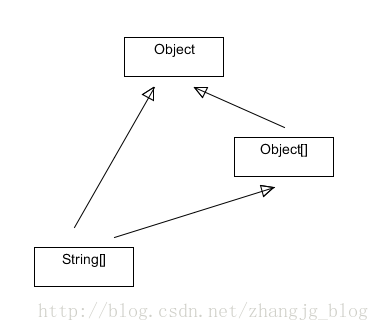

首先上答案，数组是对象。

为什么呢，因为权威的

[Java Language Specification](https://link.zhihu.com/?target=http%3A//docs.oracle.com/javase/specs/jls/se7/html/index.html)

是这么说的：

> In the Java programming language, *arrays* are objects ([§4.3.1](https://link.zhihu.com/?target=http%3A//docs.oracle.com/javase/specs/jls/se7/html/jls-4.html%23jls-4.3.1)), are dynamically created, and may be assigned to variables of type Object ([§4.3.2](https://link.zhihu.com/?target=http%3A//docs.oracle.com/javase/specs/jls/se7/html/jls-4.html%23jls-4.3.2)). All methods of class Object may be invoked on an array.

但是这个数组对象并不是从某个类实例化来的，而是由JVM直接创建的，因此查看类名的时候会发现是很奇怪的类似于"[I"这样的样子，这个直接创建的对象的父类就是Object，所以可以调用Object中的所有方法，包括你用到的toString()。

所以你的问题就很明显了，因为调用的toString()方法是来自于Object的

```text
public String toString() {
    return getClass().getName() + "@" + Integer.toHexString(hashCode());
}
```

所以就打出了类似于[I@15db9742这样的稀奇古怪的数字。

如果要输出“{1,9}”这样的内容，可以写一个循环逐个输出，或者使用Arrays.toString()输出。

---

# Java中的数组是对象吗？

## 前言

首先说明:**Java中的**[**数组**](https://windcoder.com/tag/数组)**是对象**，这个可以查看[The Java Language Specification SE(4.3.1)](https://docs.oracle.com/javase/specs/jls/se8/html/jls-4.html#jls-4.3.1)可得，另外本文讨论的相关问题的结论，在规范中都能找到，目前也被我总结在了[Java漫谈-数组](https://windcoder.com/javamantan-shuzu)中。

转载此篇文章是感觉这篇文章的对其结论的分析过程很棒。

## 正文

### Java中的[数组](https://windcoder.com/tag/数组)是对象吗？

Java和C++都是面向对象的语言。在使用这些语言的时候，我们可以直接使用标准的类库，也可以使用组合和继承等面向对象的特性构建自己的类，并且根据自己构建的类创建对象。那么，我们是不是应该考虑这样一个问题：在面向对象的语言中，[数组](https://windcoder.com/tag/数组)是对象吗？

要判断[数组](https://windcoder.com/tag/数组)是不是对象，那么首先明确什么是对象，也就是对象的定义。在较高的层面上，对象是根据某个类创建出来的一个实例，表示某类事物中一个具体的个体。对象具有各种属性，并且具有一些特定的行为。而在较低的层面上，站在计算机的角度，对象就是内存中的一个内存块，在这个内存块封装了一些数据，也就是类中定义的各个属性，所以，对象是用来封装数据的。以下为一个Person对象在内存中的表示： 


 注意：

1）小的红色矩形表示一个引用（地址）或一个基本类型的数据，大的红色矩形表示一个对象，多个小的红色矩形组合在一块，可组成一个对象。 2）name在对象中只表示一个引用， 也就是一个地址值，它指向一个真实存在的字符串对象。在这里严格区分了引用和对象。

那么在Java中，数组满足以上的条件吗？在较高的层面上，数组不是某类事物中的一个具体的个体，而是多个个体的集合。那么它应该不是对象。而在计算机的角度，数组也是一个内存块，也封装了一些数据，这样的话也可以称之为对象。以下是一个数组在内存中的表示： 


 这样的话， 数组既可以是对象， 也可以不是对象。至于到底是不是把数组当做对象，全凭Java的设计者决定。数组到底是不是对象， 通过代码验证：

```javascript
int[] a = new int[4];
//a.length;  //对属性的引用不能当成语句
int len = a.length;  //数组中保存一个字段, 表示数组的长度

//以下方法说明数组可以调用方法,java中的数组是对象.这些方法是Object中的方法,所以可以肯定,数组的最顶层父类也是Object
a.clone();
a.toString();
```

在数组a上， 可以访问他的属性，也可以调用一些方法。这基本上可以认定，java中的数组也是对象，它具有java中其他对象的一些基本特点：封装了一些数据，可以访问属性，也可以调用方法。所以，数组是对象。

而在C++中，数组虽然封装了数据，但数组名只是一个指针，指向数组中的首个元素，既没有属性，也没有方法可以调用。如下代码所示：

```javascript
int main(){
    int a[] = {1, 2, 3, 4};
    int* pa = a;
    //无法访问属性，也不能调用方法。
    return 0;
}
```

所以C++中的数组不是对象，只是一个数据的集合，而不能当做对象来使用。

### Java中数组的类型

Java是一种强类型的语言。既然是对象， 那么就必须属于一个类型，比如根据Person类创建一个对象，这个对象的类型就是Person。那么数组的类型是什么呢？看下面的代码：

```javascript
        int[] a1 = {1, 2, 3, 4};
        System.out.println(a1.getClass().getName());
        //打印出的数组类的名字为[I

        String[] s = new String[2];
        System.out.println(s.getClass().getName());
        //打印出的数组类的名字为  [Ljava.lang.String;

        String[][] ss = new String[2][3];
        System.out.println(ss.getClass().getName());
        //打印出的数组类的名字为    [[Ljava.lang.String;
```

打印出

```javascript
a1的类型为[I ，s 的类型是[Ljava.lang.String;  ,  ss的类型是[[Ljava.lang.String;  
```

所以，数组也是有类型的。只是这个类型显得比较奇怪。你可以说a1的类型是int[]，这也无可厚非。但是我们没有自己创建这个类，也没有在Java的标准库中找到这个类。也就是说不管是我们自己的代码，还是在JDK中，都没有如下定义：

```javascript
    public class int[] {

        // ...

        // ...

        // ...
    }
```

这只能有一个解释，那就是虚拟机自动创建了数组类型，可以把数组类型和8种基本数据类型一样， 当做java的内建类型。这种类型的命名规则是这样的：

- 每一维度用一个[表示；开头两个[，就代表是二维数组。
- [后面是数组中元素的类型(包括基本数据类型和引用数据类型)

在java语言层面上,s是数组,也是一个对象,那么他的类型应该是String[]，这样说是合理的。但是在JVM中，他的类型为[java.lang.String。顺便说一句普通的类在JVM里的类型为 包名+类名，也就是全限定名。同一个类型在java语言中和在虚拟机中的表示可能是不一样的。

### Java中数组的继承关系

上面已经验证了，数组是对象，也就是说可以以操作对象的方式来操作数组。并且数组在虚拟机中有它特别的类型。既然是对象，遵循Java语言中的规则 -- Object是上帝， 也就是说所有类的顶层父类都是Object。数组的顶层父类也必须是Object，这就说明数组对象可以向上直接转型到Object，也可以向下强制类型转换，也可以使用instanceof关键字做类型判定。 这一切都和普通对象一样。如下代码所示：

```javascript
        //1     在test1()中已经测试得到以下结论: 数组也是对象, 数组的顶层父类是Object, 所以可以向上转型
        int[] a = new int[8];
        Object obj = a ; //数组的父类也是Object,可以将a向上转型到Object

        //2     那么能向下转型吗?
        int[] b = (int[])obj;  //可以进行向下转型

        //3     能使用instanceof关键字判定吗?
        if(obj instanceof int[]){  //可以用instanceof关键字进行类型判定
            System.out.println("obj的真实类型是int[]");
        }
```

### Java中数组的另一种“继承”关系

如下代码是正确的，却很容易让我们疑惑：

```javascript
        String[] s = new String[5];
        Object[] obja = s;   //成立,说明可以用Object[]的引用来接收String[]的对象
```

Object[]类型的引用可以指向String[]类型的数组对象？ 由上文的验证可以得知数组类型的顶层父类一定是Object，那么上面代码中s的直接父类是谁呢？难道说String[]继承自Object[]，而Object[]又继承自Object? 让我们通过反射的方式来验证这个问题：

```javascript
        //5     那么String[] 的直接父类是Object[] 还是 Object?
        System.out.println(s.getClass().getSuperclass().getName());
        //打印结果为java.lang.Object,说明String[] 的直接父类是 Object而不是Object[]
```

由代码可知，String[]的直接父类就是Object而不是Object[]。可是Object[]的引用明明可以指向String[]类型的对象。那么他们的继承关系有点像这样： 



这样的话就违背了Java单继承的原则。String[]不可能即继承Object，又继承Object[]。上面的类图肯定是错误的。那么只能这样解释：数组类直接继承了Object，关于Object[]类型的引用能够指向String[]类型的对象，这种情况只能是Java语法之中的一个特例，并不是严格意义上的继承。也就是说，String[]不继承自Object[]，但是我可以允许你向上转型到Object[]，这种特性是赋予你的一项特权。

其实这种关系可以这样表述：如果有两个类A和B，如果B继承（extends）了A，那么A[]类型的引用就可以指向B[]类型的对象。如下代码所示：

```javascript
    public static class Father {

    }

    public static class Son extends Father {

    }
        //6   下面成立吗?  Father是Son的直接父类
        Son[] sons = new Son[3];
        Father[] fa = sons;  //成立

        //7     那么Son[] 的直接父类是Father[] 还是  Object[] 或者是Object?
        System.out.println(sons.getClass().getSuperclass().getName());
        //打印结果为java.lang.Object,说明Son[]的直接父类是Object
```

上面的结论可以扩展到二维数组和多维数组：

```javascript
        Son[][] sonss = new Son[2][4];
        Father[][] fathers = sonss;
```

上面的代码可以这样理解：

将Father[][]数组看成是一维数组, 这是个数组中的元素为Father[]，将Son[][]数组看成是一维数组, 这是个数组中的元素为Son[]，因为Father[]类型的引用可以指向Son[]类型的对象，所以，根据上面的结论，Father[][]的引用可以指向Son[][]类型的对象。

数组的这种用法不能作用于基本类型数据：

```javascript
        int[] aa = new int[4];
        //Object[] objaa = aa;  //错误的，不能通过编译
```

这是错误的, 因为int不是引用类型，Object不是int的父类，在这里自动装箱不起作用。但是这种方式是可以的：

```javascript
Object[] objss = {"aaa", 1, 2.5};
```

这种情况下自动装箱可以工作，也就是说，Object数组中可以存放任何值，包括基本数据类型。

Java为什么会为数组提供这样一种语法特性呢？也就是说这种语法有什么作用？编写过Android中Sqlite[数据库](https://cloud.tencent.com/solution/database?from=10680)操作程序的同学可能发现过这种现象，用一个Object[]引用接收所有的数组对象，在编译SQL语句时，为SQL语句中的占位符提供对应的值。

```javascript
db.execSQL("INSERT INTO person VALUES (NULL, ?, ?)", new Object[]{person.name, person.age}); 
```

所以这种特性主要是用于方法中参数的传递。如果不传递数组，而是依次传递各个值，会使方法参数列表变得冗长。如果使用具体的数组类型，如String[]，那么就限定了类型，失去了灵活性。所以传递数组类型是一种比较好的方式。但是如果没有上面的数组特性（如果有两个类A和B，如果B继承（extends）了A，那么A[]类型的引用就可以指向B[]类型的对象），那么数组类型就只能通过Object类型接收，这样就无法在方法内部访问或遍历数组中的各个元素。如下代码：

```javascript
    private static void test3() {
        String[] a = new String[3];
        doArray(a);
    }

    private static void doArray(Object[] objs){

    }

    private static void doArray1(Object obj){
        //不能用Object接收数组，因为这样无法对数组的元素进行访问
        // obj[1]  //错误

        //如果在方法内部对obj转型到数组，存在类型转换异常的风险
        // Object[] objs = (Object[]) obj;
    }

    private static void doArray2(String[] strs){
        //如果适用特定类型的数组，就限制了类型，失去灵活性和通用性
    }

    private static void doArray3(String name, int age, String id, float account){
        //如果不适用数组而是依次传递参数，会使参数列表变得冗长，难以阅读
    }
```

到此为止，数组的特性就总结完了。上文中加粗的部分为重要结论。下面贴出整个源码：

#### 源码

```javascript
package com.pansoft.zhangjg.testarray;

public class ArrayTest {

    /**
     * @param args
     */
    public static void main(String[] args) {
        test1();
        test2();
        test3();
    }

    /**
     * 数组具有这种特性：
     * 如果有两个类A和B，如果B继承（extends）了A，那么A[]类型的引用就可以指向B[]类型的对象
     * 测试数组的特殊特性对参数传递的便利性
     */
    private static void test3() {
        String[] a = new String[3];
        doArray(a);
    }

    private static void doArray(Object[] objs){

    }

    private static void doArray1(Object obj){
        //不能用Object接收数组，因为这样无法对数组的元素进行访问
        // obj[1]  //错误

        //如果在方法内部对obj转型到数组，存在类型转换异常的风险
        // Object[] objs = (Object[]) obj;
    }

    private static void doArray2(String[] strs){
        //如果适用特定类型的数组，就限制了类型，失去灵活性和通用性
    }

    private static void doArray3(String name, int age, String id, float account){
        //如果不适用数组而是依次传递参数，会使参数列表变得冗长，难以阅读
    }
    /**
     * 测试数组的集成关系, 并且他的继承关系是否和数组中元素的类型有关
     */
    private static void test2() {

        //1     在test1()中已经测试得到以下结论: 数组也是对象, 数组的顶层父类是Object, 所以可以向上转型
        int[] a = new int[8];
        Object obj = a ; //数组的父类也是Object,可以将a向上转型到Object

        //2     那么能向下转型吗?
        int[] b = (int[])obj;  //可以进行向下转型

        //3     能使用instanceof关键字判定吗?
        if(obj instanceof int[]){  //可以用instanceof关键字进行类型判定
            System.out.println("obj的真实类型是int[]");
        }

        //4     下面代码成立吗?
        String[] s = new String[5];
        Object[] obja = s;   //成立,说明可以用Object[]的引用来接收String[]的对象

        //5     那么String[] 的直接父类是Object[] 还是 Object?
        System.out.println(s.getClass().getSuperclass().getName());
        //打印结果为java.lang.Object,说明String[] 的直接父类是 Object而不是Object[]

        //6   下面成立吗?  Father是Son的直接父类
        Son[] sons = new Son[3];
        Father[] fa = sons;  //成立

        //7     那么Son[] 的直接父类是Father[] 还是  Object[] 或者是Object?
        System.out.println(sons.getClass().getSuperclass().getName());
        //打印结果为java.lang.Object,说明Son[]的直接父类是Object

        /**
         * 做一下总结, 如果A是B的父类, 那么A[] 类型的引用可以指向 B[]类型的变量
         * 但是B[]的直接父类是Object, 所有数组的父类都是Object
         */

        //8     上面的结论可以扩展到二维数组
        Son[][] sonss = new Son[2][4];
        Father[][] fathers = sonss;
        //将Father[][]数组看成是一维数组, 这是个数组中的元素为Father[]
        //将Son[][]数组看成是一维数组, 这是个数组中的元素为Son[]
        //因为Father[]类型的引用可以指向Son[]类型的对象
        //所以,根据上面的结论,Father[][]的引用可以指向Son[][]类型的对象

        /**
         * 扩展结论:
         * 因为Object是所有引用类型的父类
         * 所以Object[]的引用可以指向任何引用数据类型的数组的对象. 如:
         * Object[] objs = new String[1];
         * Object[] objs = new Son[1];
         *
         */

        //9     下面的代码成立吗?
        int[] aa = new int[4];
        //Object[] objaa = aa;  //错误的，不能通过编译
        //这是错误的, 因为Object不是int的父类,在这里自动装箱不起作用

        //10    这样可以吗？
        Object[] objss = {"aaa", 1, 2.5};//成立
    }

    /**
     * 测试在java语言中,数组是不是对象
     * 如果是对象, 那么他的类型是什么?
     */
    private static void test1() {
        int[] a = new int[4];
        //a.length;  //对属性的引用不能当成语句
        int len = a.length;  //数组中保存一个字段, 表示数组的长度

        //以下方法说明数组可以调用方法,java中的数组是对象.这些方法是Object中的方法,所以可以肯定,数组的最顶层父类也是Object
        a.clone();
        a.toString();


        /**
         * java是强类型的语言,一个对象总会有一个特定的类型,例如 Person p = new Person();
         * 对象p(确切的说是引用)的类型是Person类, 这个Person类是我们自己编写的
         * 那么数组的类型是什么呢? 下面使用反射的方式进行验证
         */
        int[] a1 = {1, 2, 3, 4};
        System.out.println(a1.getClass().getName());
        //打印出的数组类的名字为[I

        String[] s = new String[2];
        System.out.println(s.getClass().getName());
        //打印出的数组类的名字为  [Ljava.lang.String;

        String[][] ss = new String[2][3];
        System.out.println(ss.getClass().getName());
        //打印出的数组类的名字为    [[Ljava.lang.String;

        /**
         * 所以,数组也是有类型的,只不过这个类型不是有程序员自己定义的类, 也不是jdk里面
         * 的类, 而是虚拟机在运行时专门创建的类
         * 类型的命名规则是:
         *      每一维度用一个[表示;
         *      [后面是数组中元素的类型(包括基本数据类型和引用数据类型)
         * 
         * 在java语言层面上,s是数组,也是一个对象,那么他的类型应该是String[],
         * 但是在JVM中,他的类型为[java.lang.String
         * 
         * 顺便说一句普通的类在JVM里的类型为 包名+类名, 也就是全限定名
         */
    }

    public static class Father {

    }

    public static class Son extends Father {

    }
}
```